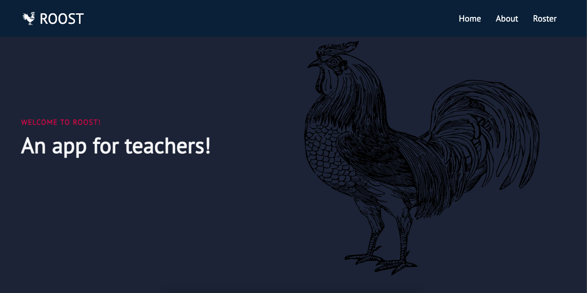
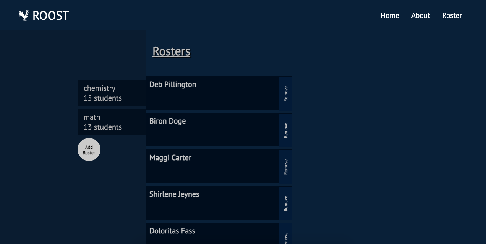

    // "node": "10.11.0"

Roost API Server- An app designed for teachers to randomize seating charts.

Live Links:
React app here: https://roost-client.vercel.app/
and Node app here: https://afternoon-inlet-82835.herokuapp.com

Description:
API for Roost Application. The API stores students names, Teacher names, and classes. Together it will generate a roster that the user will be able to shuffle their students names. The Roost application is used to generate a shuffled list of names within a user created roster. A visitor and user are not required to login.

As a visitor or user, you will be able to access the home, about, and roster pages. In the home page you will be able to preview the app and decide if you would like to get started with the use of the application. 

Every User has the ability to create a roster.Within the roster a user is able to add and delete a student from their roster. Furthermore, a user is able to shuffle their list of students.

Technology Used:
Front-End: HTML5, CSS3, JavaScript ES6, React
Back-End: Node.js, Express.js, Mocha, Chai, RESTful API Endpoints, Postgres
Development Environment: Heroku, DBeaver, Vercel

Back-End Structure:
https://afternoon-inlet-82835.herokuapp.com

* teachers (database table)(parent to students to table)
    * id (auto-generated)
    * first_name (varchar255) (validation alpha characters with spaces min.3 max.255)
    * last_name (varchar255) (validation alpha characters with spaces min.3 max.255)
    * email (varchar255) (email validation)

* classes (database table)(parent to students table)
    * id (auto-generated)
	* name (varchar255) (validation alpha characters with spaces min.3 max.255)

* students (database table) (child to both teachers and classes table)
    * id (auto-generated)
    * teacher_id FOREIGN KEY TO TEACHERS TABLE (auto-generated)
    * classes_id FOREIGN KEY TO CLASSES TABLE (auto-generated)
	* first_name (varchar255) (validation alpha characters with spaces min.3 max.255)
    * last_name (varchar255) (validation alpha characters with spaces min.3 max.255)

App Structure:
migrations folder contains all the sql files necesay for the DB setup
public folder contains the View related files
seeds folder contains the files for the database
src folder contains the Controller related files
server.js is the entry point of the Controller logic (where all the general app settings live)
app.js is the starting point for the routes
classes, students, and teachers folders contains the router with all the API endpoints and 
service files for the Controller connection witht the Model
logger.js contains middleware functions that are used by the controller in multiple places
test folder contains the Test files

GET classes: https://afternoon-inlet-82835.herokuapp.com/classes

Example Response:
[
    {
        "id": "1",
        "name": "chemistry"
    },
    {
        "id": "2",
        "name": "math"
    }
]

GET Endpoint: https://afternoon-inlet-82835.herokuapp.com/students

Example Response:[
    {
        "id": 41,
        "teachers_id": 1,
        "classes_id": 2,
        "first_name": "Rosa",
        "last_name": "Beswetherick"
    },
    {
        "id": 42,
        "teachers_id": 1,
        "classes_id": 2,
        "first_name": "Tara",
        "last_name": "Clewer"
    },
    {
        "id": 43,
        "teachers_id": 1,
        "classes_id": 2,
        "first_name": "Nehemiah",
        "last_name": "Mathonnet"
    },
    {
        "id": 44,
        "teachers_id": 1,
        "classes_id": 2,
        "first_name": "Maurine",
        "last_name": "Ferrulli"
    },
    {
        "id": 45,
        "teachers_id": 1,
        "classes_id": 2,
        "first_name": "Art",
        "last_name": "Castanares"
    }
]

RANDOMIZE GET Endpoint:https://afternoon-inlet-82835.herokuapp.com/students

Example Response:[
    {
        "id": 17,
        "teachers_id": 1,
        "classes_id": 1,
        "first_name": "Shirlene",
        "last_name": "Jeynes"
    },
    {
        "id": 22,
        "teachers_id": 1,
        "classes_id": 1,
        "first_name": "Doloritas",
        "last_name": "Fass"
    }
]

API Documentation details:
* GET/students
    * URL: https://afternoon-inlet-82835.herokuapp.com
    * Response:[
    {
	"id": 2,
	"teachers_id": 1,
	"classes_id": 1,
	"first_name": "Biron",
	"last_name": "Doge"
    }
] 
 
 

Landing Page
:-------------------------:

Roster Page

This is v1.0 of the app, but future enhancements are expected to include:
Add save, edit, print and email functionality. 

How to Set it up:
Use the command line in your terminal to clone repository. Navigate into the project folder and run the following in terminal:

Install the dependencies for the project:
npm install

If there are high vulnerabilities reported during the install:
npm audit fix --force

Node Scripts:
To install the node project ===> npm install
To migrate the database ===> npm run migrate 
To run Node server (on port 8000) ===> npm run dev
